| [English](./README.md) | [Korean](./README/README_ko.md) | 

  

</br>

# 🚨 Smart Unmanned Store: YOLO AI Abnormal Behavior Detection & Alert App

### **Development Period**

- **Overall Development Period**: 2025.04.29 - 2025.06.19
- **UI Implementation**: 2025.05.02 - 2025.05.15
- **Feature Implementation**: 2025.05.13 - 2025.06.19

</br>

## 1. Project Introduction

This project is an unmanned store abnormal behavior detection application based on YOLO.

</br>

**YOLO-based Abnormal Behavior Detection & Alert**

- The YOLO model analyzes CCTV footage from unmanned stores in real-time to detect abnormal behavior.
- When abnormal behavior is detected, the application's notification window displays the time of occurrence and the details of the abnormal behavior.
- **Target Abnormal Behaviors**: Falling, Theft, Smoking, Fighting.

</br>


**CCTV Video Storage & Provision**

- CCTV clips and screenshots from the moment abnormal behavior is detected are automatically saved.
- These saved clips and screenshots allow for quick understanding of the abnormal behavior and facilitate prompt follow-up actions.

</br>

## 2. Development Environment


* **Design**: Figma
* **Front-End**: Flutter
* **Back-End**: FastAPI
* **Database**: SQLite
* **Collaboration Tools**: GitHub, Notion

</br>

## 3. Technology Stack Selection Rationale

###  **Flutter**

Our team chose the Flutter framework for front-end development. The primary reason was its ability to maximize development efficiency by supporting various platforms such as web, Android, and iOS from a single codebase. Beyond this, Flutter offered the following technical strengths that contributed to achieving our project goals:

</br>

**High Development Productivity (Hot Reload & Hot Restart)**

Flutter's Hot Reload instantly reflects code changes without needing to restart the app, accelerating development for UI adjustments or bug fixes. Additionally, Hot Restart provides quick restarts while resetting the app's state, saving significant development time.

</br>

**Consistent UI/UX (Customizable Widgets & Skia Engine)**  

Flutter offers a rich widget library based on Google's Material Design and Apple's Cupertino design systems. This enabled us to build a consistent UI across all platforms. Furthermore, by using its own rendering engine, Skia, Flutter directly draws the UI independently of the OS, resulting in fewer compatibility issues across different OS versions or device types and providing an excellent user experience (UX).

</br>

**Outstanding Performance (Native Compiled Code)**  

Flutter apps compile Dart code directly into ARM or Intel machine code. This delivers high performance comparable to native apps, enabling the implementation of fast and responsive applications.

</br>

**Considering Team Proficiency**  

For team members with limited prior front-end development experience, Flutter's intuitive widget structure and clear documentation significantly lowered the learning curve, enabling efficient development within a short period.

</br>

###  **Fast-API**

Our team selected **FastAPI** as the backend framework. We determined that FastAPI, as a modern Python web framework, was well-suited for our project requirements due to its fast development speed, high performance, and intuitive code structure.

</br>

**Team's Python Proficiency and High Productivity**  

All our team members were familiar with Python, allowing us to quickly begin development without spending much time learning a new framework. FastAPI seamlessly integrates Python's syntax and type hints, enabling us to naturally apply existing Python knowledge to backend development.

</br>

**Fast Development Speed & Automatic Documentation**
  
FastAPI declares APIs based on Python's type hints, which provides automatic documentation features via Swagger UI and ReDoc. This was highly useful during API testing and client integration, playing a significant role in boosting development productivity.

</br>

**High Performance (Asynchronous Processing Support)**  

Built on Starlette, FastAPI actively supports Python's `async`/`await` syntax. This allowed for efficient handling of I/O-bound tasks and demonstrated excellent 

</br>

**Concise and Clear Code Structure**  

FastAPI enables more structured code than Flask and lighter, more concise code than Django. This significantly improved the maintainability and readability of our backend code.

</br>

**Automatic Data Validation and Serialization (Pydantic-based)**  

FastAPI automatically handles input data validation and serialization through Pydantic. This was advantageous for managing complex data structures and effectively preventing user input errors.

</br>

**Excellent Documentation and Community Support**  

FastAPI boasts well-organized official documentation and an active open-source community, which allowed for quick problem-solving when issues arose.

</br>

## 4. Project Setup and Execution

### Required Tools
* **Flutter SDK**: 3.32.0
* **Git**: Required for repository cloning
* **IDE**: VSCode (other options available)

</br>

### Project Installation

**1. Clone the Repository**

```bash
git clone https://github.com/embedded-final-project-group-A/CCTV_FE.git
cd CCTV_FE
```

**2. Install Dependencies**

Navigate into the project folder and install all necessary Flutter packages and dependencies:

```bash
flutter pub get
```

**3. Check Available Device**

You can check the list of currently available devices or platforms:

```bash
flutter devices
```

</br>

### Running the Application

Select a ready device or platform and execute the following command to run the application:

```bash
flutter run
```

**Web Browser Execution (Recommended)**

```bash
flutter run -d chrome
```

If you wish to run it on an Android emulator, connect a physical Android device with USB debugging enabled and use the `flutter run` command. 

Please note that some features may be limited when running on an Android emulator.

iOS simulator is not supported.

</br>

## 5. 프로젝트 구조

The main file structure of the project is as follows:

```markdown
📁 CCTV_FE/
│
├── README.md                         # Project description document
├── pubspec.yaml                      # Flutter dependencies and configuration file
│
├── 📁 assets/                        # Static assets used in the app
│   └── 📁 images/
│       └── profile.png               # Default user profile image
│
├── 📁 lib/                           # Core Flutter application source code
│   ├── 📁 constants/                 # Definitions for constants (e.g., colors, styles)
│
│   ├── 📁 screens/                   # Main UI screens (pages)
│   │   ├── aboutus.dart              # About Us screen
│   │   ├── camera_registration.dart  # Camera registration screen
│   │   ├── events.dart               # Event list and detail screen
│   │   ├── home.dart                 # Home screen
│   │   ├── notifications.dart        # Notification screen
│   │   ├── profile.dart              # User profile screen
│   │   ├── signin.dart               # Sign-in (login) screen
│   │   ├── signup.dart               # Sign-up (registration) screen
│   │   ├── store_registration.dart   # Store registration screen
│   │   └── support.dart              # Customer support / inquiry screen
│
│   ├── 📁 wrappers/                  # Common layout or navigation wrappers
│   │   └── bottom_nav_wrapper.dart   # Bottom navigation bar wrapper
│   └── main.dart                     # Application entry point (Flutter main file)
```

</br>

## 6. Page-Specific Features

This project's application leverages YOLO technology to detect abnormal behavior in unmanned stores in real-time, providing store owners with instant notifications and evidence. Through the app's main features, store owners can manage their stores safely and efficiently.  

</br>

### **Application Test Accounts**

<table>
  <tr>
    <td>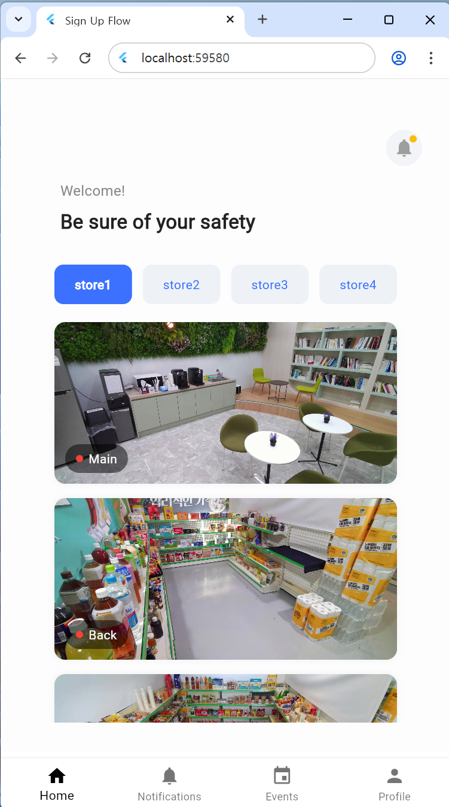</td>
    <td>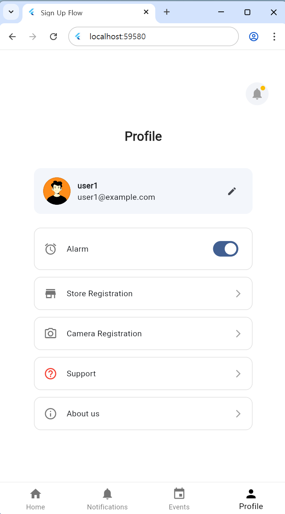</td>
  </tr>
</table>

* ID: user1 / PW: password1
* ID: user2 / PW: password2

</br>

### User Information Management (or Account Management)

**Sing Up**

<table>
  <tr>
    <td>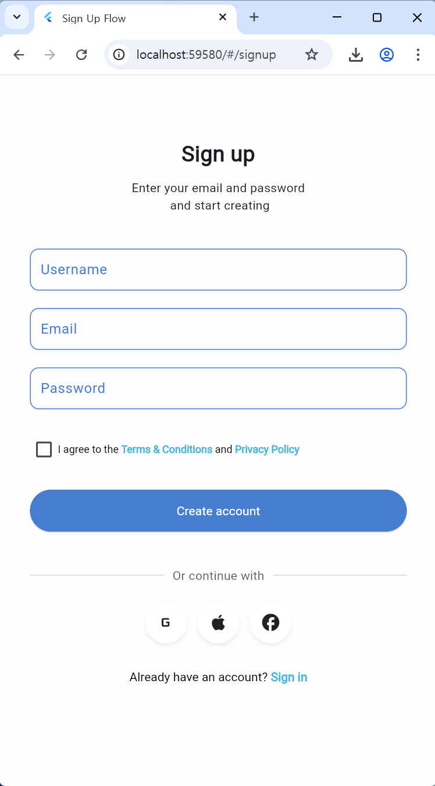</td>
    <td>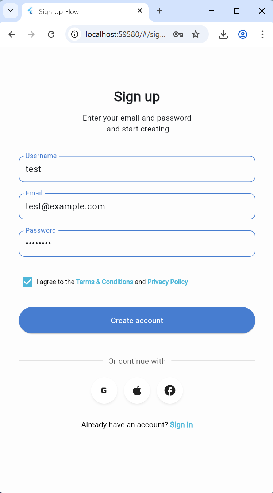</td>
    <td>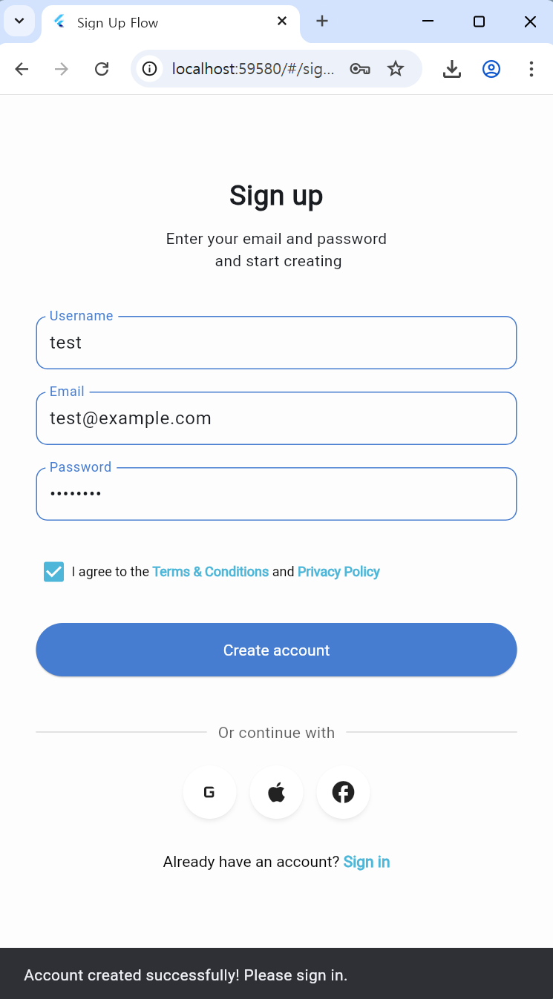</td>
  </tr>
</table>

* **Account Creation**: Create an account by entering your username, email, and password. (Consent to the terms and conditions via checkbox is required.)
* **Post-Sign Up Guidance**: Upon successful registration, a message guiding you to the login screen will be displayed.

</br>

**Sign In**

<table>
  <tr>
    <td>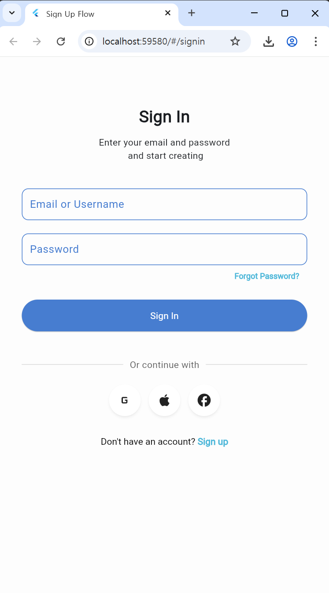</td>
    <td>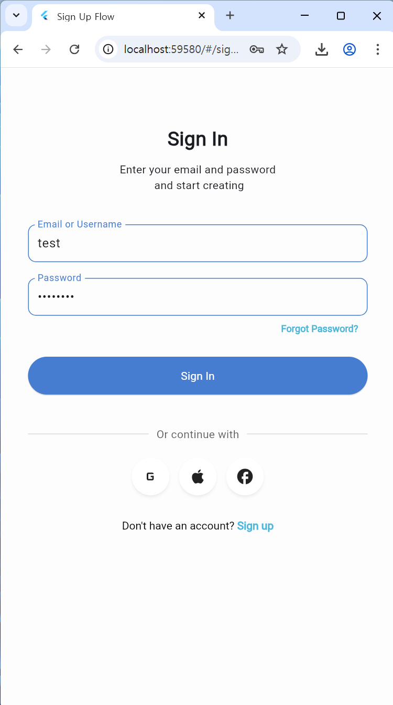</td>
  </tr>
</table>

* **Login Process**: You can log in by entering either your username or email, followed by the corresponding account's password.

</br>

**프로필 (Profile)**

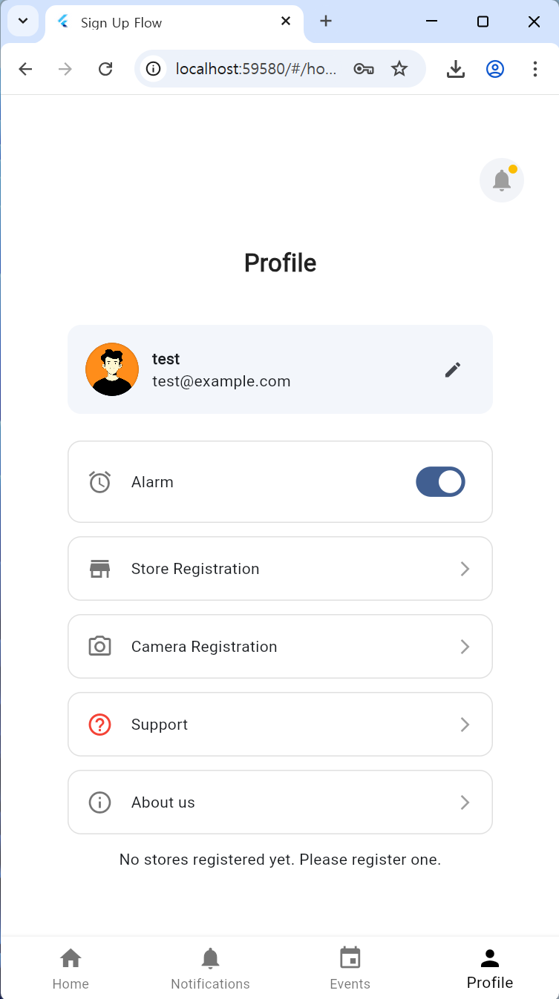

- Displays the username and email of the logged-in account.

</br>

**Storage Registration**
<table>
  <tr>
    <td></td>
    <td></td>
    <td>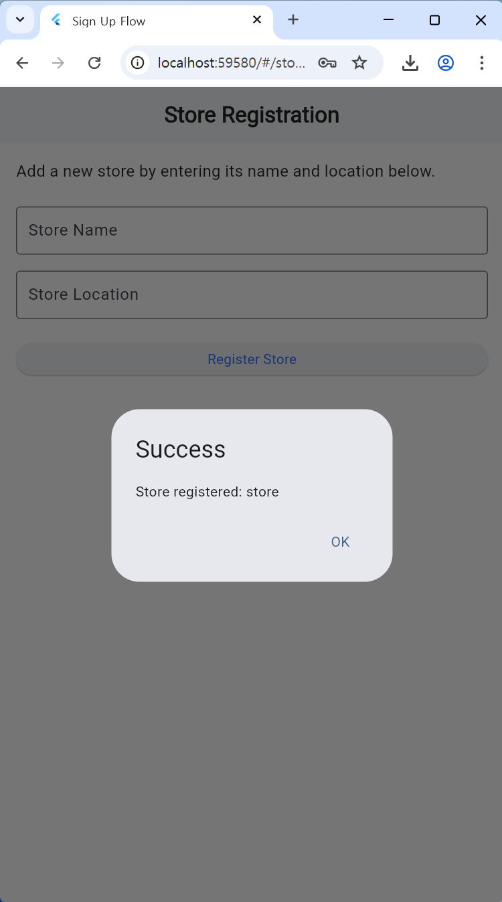</td>
  </tr>
</table>

- Add new stores by entering the store name and location.

</br>

**Camera Registration**

<table>
  <tr>
    <td></td> 
    <td></td> 
  </tr>
</table>

- Select a store and add new CCTV equipment by entering the camera name and URL.

</br>

### Home

<table>
  <tr>
    <td>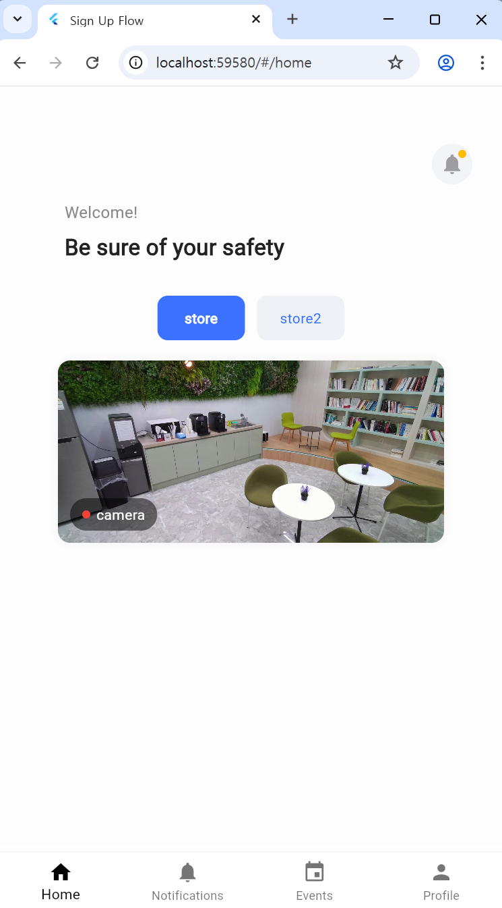</td> 
    <td>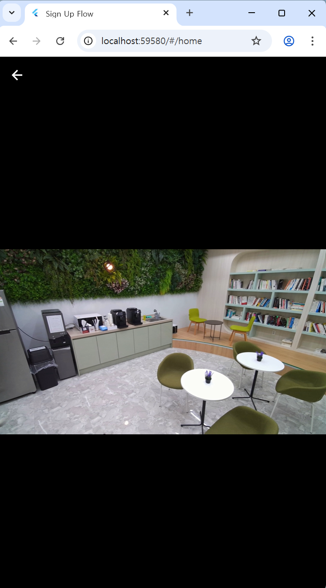</td> 
    <td>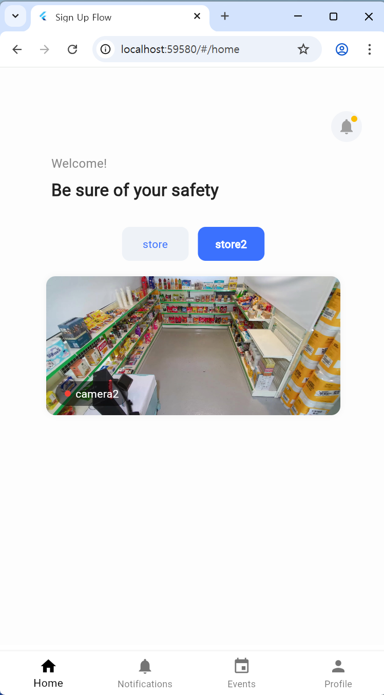</td> 
  </tr>
</table>

* **View Registered Stores and Cameras**: Displays registered stores and cameras based on the logged-in account's user ID.
* **Real-time Video Monitoring**: Clicking on each camera's thumbnail allows for real-time monitoring of the store's situation.  

(Note: Due to time constraints in implementing real-time communication for this application, videos stored on the backend server are displayed instead of live streams.)

### Notification

<table>
  <tr>
    <td>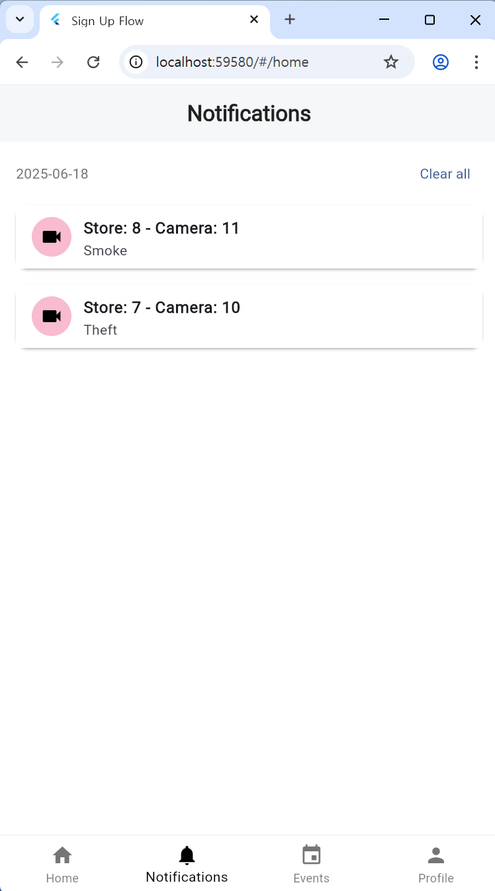</td> 
    <td>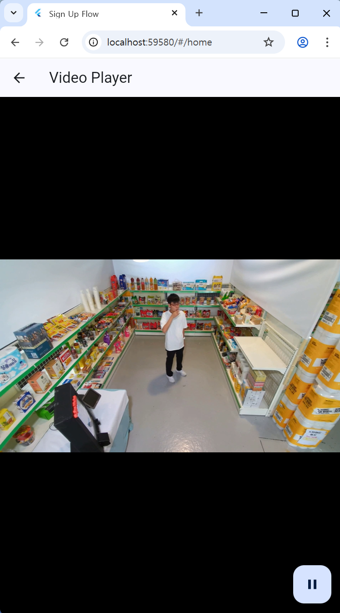</td> 
  </tr>
</table>

* **Real-time Alerts**: When a new abnormal behavior event is detected and saved, an alert is sent to the app.

</br>

### Events

<table>
  <tr>
    <td>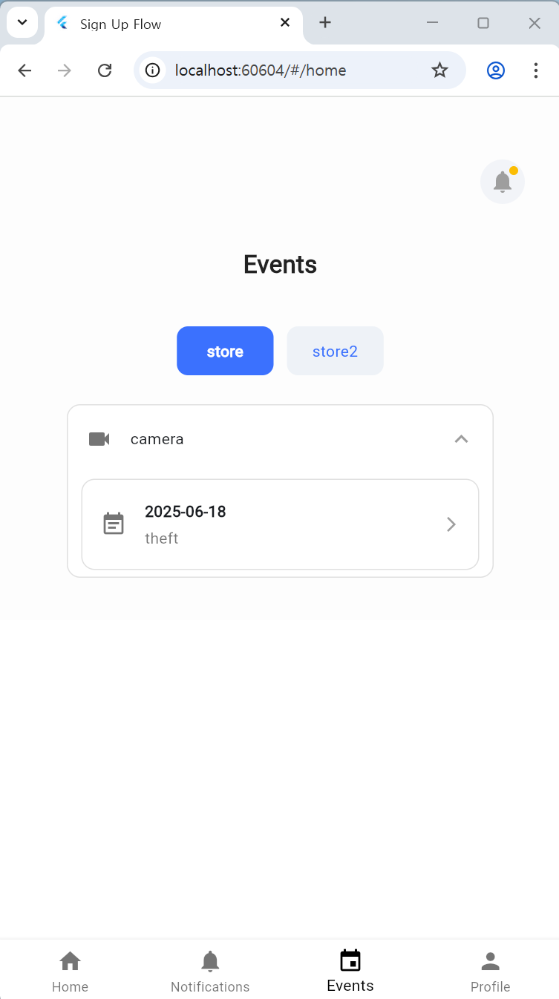</td> 
    <td>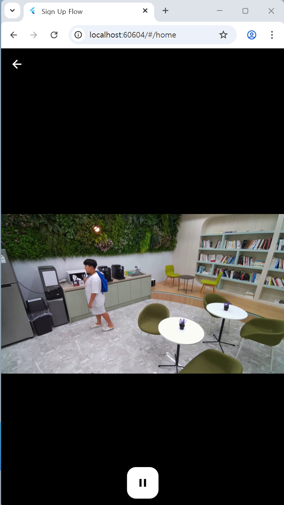</td> 
  </tr>
</table>

* **View Event History**: Retrieves the event logs for stores based on the logged-in account's user ID.

* **Clip Playback**: Provides video playback of the moment abnormal behavior occurred for each event, enabling detailed situation assessment.

</br>

## 7. Role Distribution

### 👩🏻‍💻 **Yerim Choi**
- **UI Design**: Sign Up, Sign In, Home, Notification, Events, Profile, Navigator
- **Front-End**: Sign Up, Sign In, Home, Notification, Events, Profile, Navigator
- **Back-End**: Database, Auth, Camera, Events, Store, User  
- **YOLO**: Data Collection, YOLO Detection Implementation

### 👩🏻‍💻 **Yujin Min**
- **Front-End**: Events
- **Back-End**: Events  
- **YOLO**: Data Collection

### 👨🏻‍💻 **Taekmin Youn**
- **YOLO**: Data Collection, Data Preprocessing, Model Training

</br>

## 8. Future Plans

Our project, the YOLO-based unmanned store abnormal behavior detection system, aims for continuous development to provide users with more stable and convenient services. Although not yet implemented, the following are key features we plan to add through future development:

</br>

**Individual User Server Implementation**  

Currently, the system operates in a single server environment. In the future, we plan to establish customized server environments for individual users to enhance data security and respond more flexibly to specific user requirements.

**Extended Login Functionality** 
 
While basic login functionality is provided, we intend to implement "Forgot Password" functionality and integrate social login options to enhance user convenience.

The main reasons these features are not yet implemented are our team's limited front-end development experience and challenges with server operations. As this project was our team's first attempt, we faced many challenges in both technology stack selection and the actual implementation process. However, we are committed to continuously learning and evolving to overcome these limitations and provide an even more robust and user-friendly service.