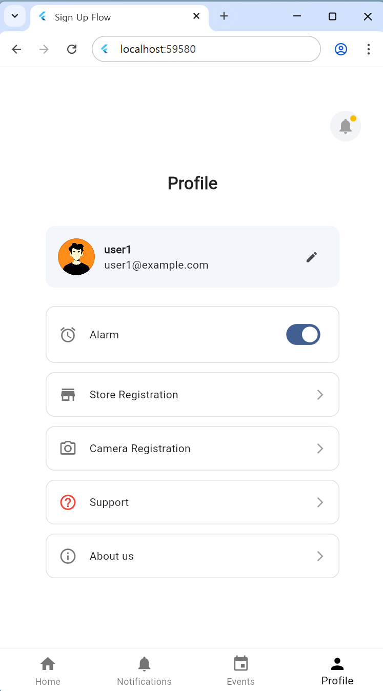
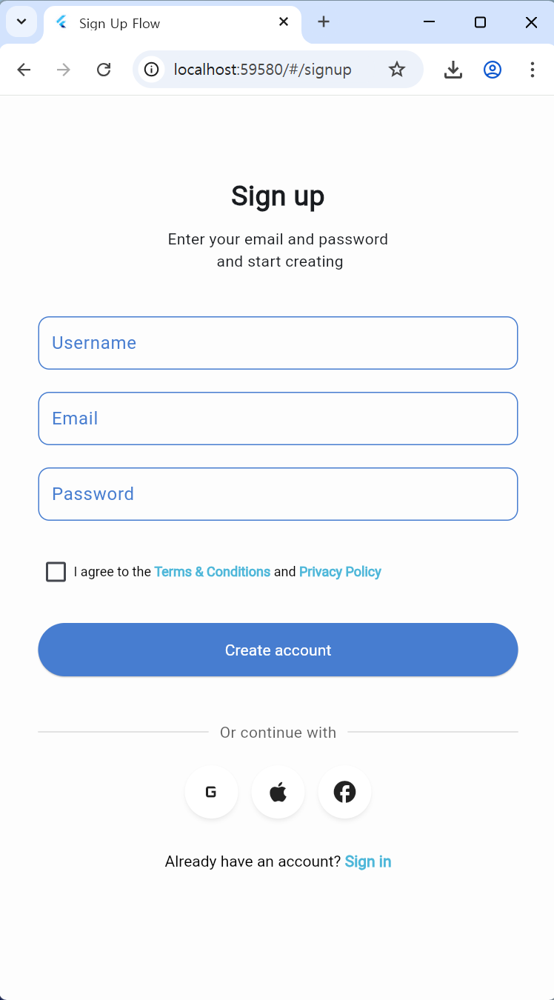
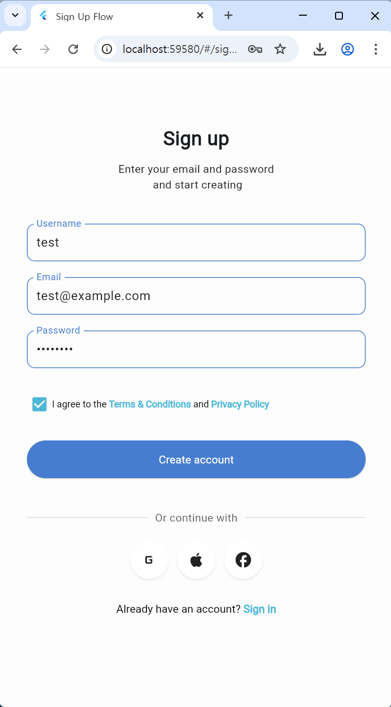
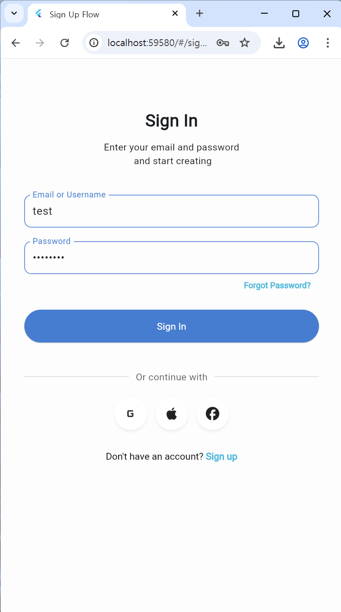
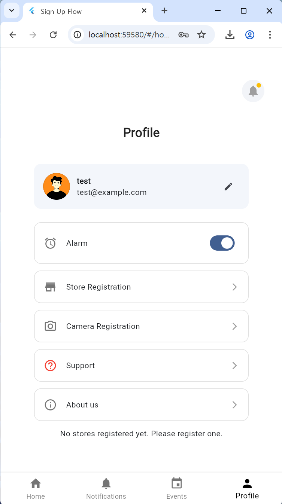
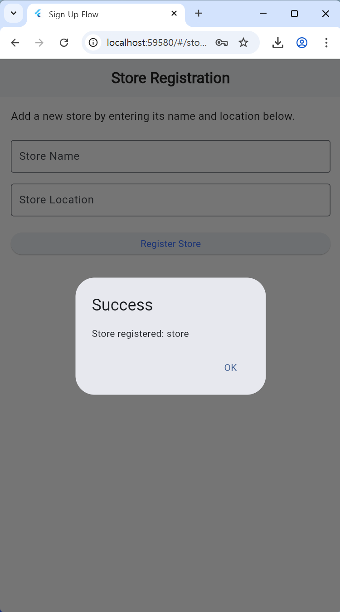
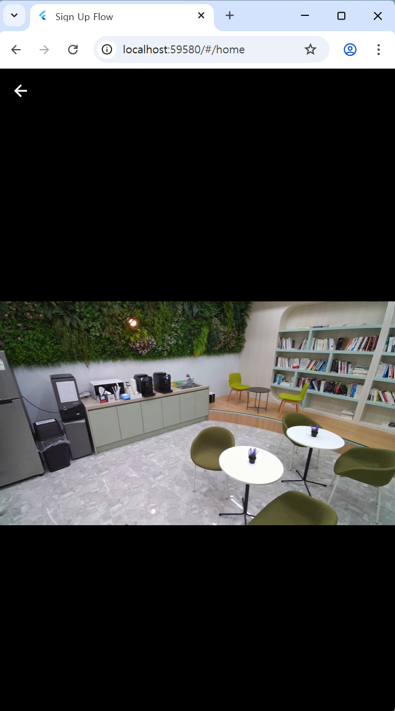
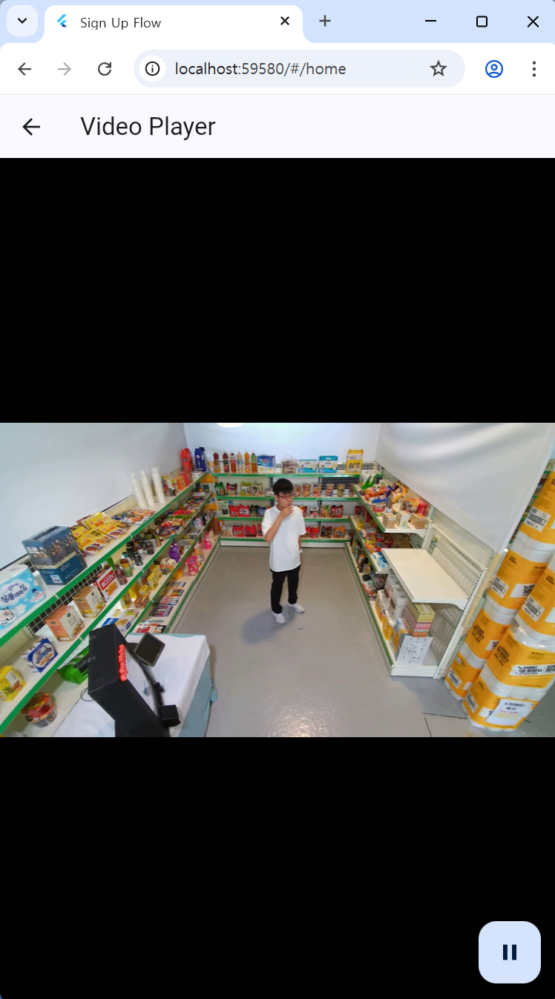

| [English](../README.md) | [Korean](./README_ko.md) | 

  

</br>

# 🚨 스마트 무인매장: YOLO AI 이상행동 감지 & 알림상행동 감지 & 알림 앱

### **개발 기간**

- **전체 개발 기간**: 2025.04.29 - 2025.06.19
- **UI 구현**: 2025.05.02 - 2025.05.15
- **기능 구현**: 2025.05.13 - 2025.06.19

</br>

백엔드 서버와 관련된 더 자세한 내용은 [CCTV_BE 레포지토리](https://github.com/embedded-final-project-group-A/CCTV_BE)에 정리되어 있습니다. 

이번 프로젝트에서 사용된 YOLO 모델에 대한 정보는 [YOLO 레포지토리](https://github.com/embedded-final-project-group-A/YOLO)에 정리되어 있습니다. 

</br>

## 1. 프로젝트 소개

본 프로젝트는 YOLO를 기반으로 한 무인매장 이상행동 탐지 어플리케이션입니다. 

</br>

**YOLO 기반 이상행동 탐지 및 알림**

- 무인 매장 CCTV 영상을 YOLO 모델이 실시간으로 분석하여 이상행동을 감지
- 이상행동 감지 시 앱 알림창에 발생 시각 및 이상 행동 내용이 표시됩니다
- **감지 대상 이상행동**: 쓰러짐, 도난, 흡연, 싸움

</br>


**CCTV 영상 저장 및 제공**

- 이상행동 탐지 순간의 CCTV 클립과 스크린 샷이 자동으로 저장됩니다
- 저장된 클립 및 스크린샷을 통해 이상행동을 파악하고 신속하게 후속 조치가 가능합니다.

</br>

## 2. 개발 환경


- **UX/UI**: Figma
- **Front-End**: Flutter
- **Back-End**: Python, Fast-API, Unicorn
- **데이터베이스**: SQLite
- **YOLO**: Python, YOLO v8
- **협업 툴**: Github, Notion

</br>


</br>

## 3. 기술 스택 선정 이유

###  **Flutter**

저희 팀은 프론트엔드 개발에 Flutter 프레임워크를 선택했습니다. 가장 큰 이유는 단일 코드베이스로 웹, Android, iOS 등 다양한 플랫폼을 모두 지원하여 개발 효율성을 극대화할 수 있다는 점이었습니다. 이 외에도 Flutter는 다음과 같은 기술적 강점을 제공하여 프로젝트 목표 달성에 기여했습니다.

</br>

**높은 개발 생산성 (Hot Reload & Hot Restart)**

Flutter의 Hot Reload는 코드 변경 사항을 앱을 다시 시작할 필요 없이 즉시 반영해, UI 변경이나 버그 수정 시 개발 속도를 향상시킵니다. 또한, Hot Restart는 앱의 상태를 초기화하면서도 빠른 재시작을 제공하여 개발 시간을 절약할 수 있게 했습니다.

</br>

**일관된 UI/UX (Customizable Widgets & Skia 엔진)**
Flutter는 Google의 Material Design 및 Apple의 Cupertino 디자인 시스템을 기반으로 하는 위젯 라이브러리를 제공합니다. 덕분에 어떤 플랫폼에서든 일관된 UI를 구축할 수 있습니다. 또한, 자체 렌더링 엔진인 Skia를 사용해 플랫폼에 독립적으로 UI를 직접 그리기 때문에, OS 버전이나 기기 종류에 따른 호환성 문제가 적고 뛰어난 사용자 경험(UX)을 제공합니다.

</br>

**뛰어난 성능 (Native Compiled Code)**

Flutter 앱은 Dart 언어로 작성된 코드를 ARM 또는 Intel 머신 코드로 직접 컴파일합니다. 이는 네이티브 앱에 버금가는 고성능을 제공하여 빠르고 반응성이 뛰어난 앱 구현을 가능하게 합니다.

</br>

**팀 숙련도 고려**

프론트엔드 개발 경험이 부족했던 팀원들에게 Flutter의 직관적인 위젯 구조와 명확한 문서화는 학습 장벽을 낮춰, 단기간 내 효율적인 개발을 가능하게 했습니다.

</br>

###  **Fast-API**

저희 팀은 백엔드 프레임워크로 **FastAPI**를 선택했습니다. FastAPI는 현대적인 Python 웹 프레임워크로, 빠른 개발 속도와 높은 성능, 직관적인 코드 구조를 제공하여 프로젝트 요구사항에 적합하다고 판단했습니다.

</br>

**팀의 Python 숙련도와 높은 생산성**

저희 팀원들은 모두 Python에 익숙하여, 새로운 프레임워크를 학습하는 데 많은 시간을 들이지 않고도 빠르게 개발에 착수할 수 있었습니다. FastAPI는 Python의 문법과 타입 힌트를 그대로 활용하기 때문에, 기존에 사용하던 Python 지식을 자연스럽게 백엔드 개발에 접목시킬 수 있었습니다.

</br>

**빠른 개발 속도 및 자동 문서화**

FastAPI는 Python의 **타입 힌트**를 기반으로 API를 선언하며, 이를 통해 **Swagger UI** 및 **ReDoc** 기반의 자동 문서화 기능을 제공합니다. 이는 API 테스트 및 클라이언트 연동 과정에서 매우 유용했고, 개발 생산성을 높이는 데 큰 역할을 했습니다.

</br>

**높은 성능 (비동기 처리 지원)**

FastAPI는 **Starlette**를 기반으로 하며, Python의 `async`/`await` 문법을 적극적으로 지원합니다. 이를 통해 I/O 병목이 발생하는 작업들을 효율적으로 처리할 수 있었고, 동시 사용자 처리 성능 또한 우수했습니다.

</br>

**간결하고 명확한 코드 구조**

FastAPI는 Flask보다 더 구조적이며, Django보다 더 가볍고 간결한 코드 작성이 가능합니다. 덕분에 백엔드 코드의 유지보수성과 가독성이 크게 향상되었습니다.

</br>

**데이터 검증 및 직렬화 자동 처리 (Pydantic 기반)**

FastAPI는 **Pydantic**을 통해 입력 데이터의 유효성 검사 및 직렬화를 자동으로 처리합니다. 이는 복잡한 데이터 구조를 다루는 데 유리하며, 사용자 입력 오류를 효과적으로 방지할 수 있었습니다.

</br>

**우수한 문서화 및 커뮤니티 지원**

FastAPI는 공식 문서가 잘 정리되어 있을 뿐 아니라, 오픈소스 커뮤니티도 활발히 운영되고 있어 문제 발생 시 빠른 해결이 가능했습니다.

</br>

## 4. 프로젝트 설치 및 실행 방법

### 필수 설치 도구

- **Flutter SDK**: 3.32.0
- **Git:** 저장소 클론을 위해 필요
- **IDE**: VSCode (다른 옵션 선택 가능)

</br>

### 프로젝트 설치

**1. 프로젝트 저장소 클론**

```bash
git clone https://github.com/embedded-final-project-group-A/CCTV_FE.git
cd CCTV_FE
```

**2. 종속성 설치:**

프로젝트 폴더로 이동한 후, 필요한 모든 Flutter 패키지 및 종속성을 설치합니다.

```bash
flutter pub get
```

**3. 실행 가능한 디바이스 확인:**

현재 실행 가능한 디바이스 또는 플랫폼 목록을 확인할 수 있습니다. 

```bash
flutter devices
```

</br>

### 어플리케이션 실행

준비된 디바이스 또는 플랫폼을 선택하고 다음 명령어를 실행하여 애플리케이션을 구동합니다.

```bash
flutter run
```

**웹 브라우저 실행(권장)**

```bash
flutter run -d chrome
```

본 프로젝트는 웹 브라우저에서 실행하는 것을 전제로 개발되었습니다. 

만약 Android 에뮬레이터로 실행하고 싶은 경우, USB 디버깅이 활성화된 Android 물리 디바이스를 연결한 후 `flutter run` 명령어를 사용하세요. Andoird 에뮬레이터의 경우 일부 기능이 제한될 수 있습니다. 

iOS 시뮬레이터는 제공되지 않습니다. 

</br>

## 5. 프로젝트 구조

프로젝트에서 주요 파일들의구조는 다음과 같습니다. 

```markdown
📁 CCTV_FE/
│
├── README.md                         # 프로젝트 설명 문서
├── pubspec.yaml                      # Flutter 의존성 및 설정 파일
│
├── 📁 assets/                       # 앱에서 사용하는 정적 자산
│   └── 📁 images/
│       └── profile.png               # 사용자 프로필 이미지 (기본 이미지)
│
├── 📁 lib/                           # Flutter 애플리케이션 핵심 코드
│   ├── 📁 constants/                 # 상수 정의 (ex. 색상, 스타일 등)
│
│   ├── 📁 screens/                   # 주요 UI 화면 (페이지)
│   │   ├── aboutus.dart              # About Us 화면
│   │   ├── camera_registration.dart  # 카메라 등록 화면
│   │   ├── events.dart               # 이벤트 목록 및 세부 정보 화면
│   │   ├── home.dart                 # 홈 화면
│   │   ├── notifications.dart        # 알림 화면
│   │   ├── profile.dart              # 사용자 프로필 화면
│   │   ├── signin.dart               # 로그인 화면
│   │   ├── signup.dart               # 회원가입 화면
│   │   ├── store_registration.dart   # 매장 등록 화면
│   │   └── support.dart              # 고객 지원/문의 화면
│
│   ├── 📁 wrappers/                # 공통 레이아웃 또는 네비게이션 래퍼
│   │   └── bottom_nav_wrapper.dart  # 하단 네비게이션 바 래퍼
│   └── main.dart                    # 앱 진입점 (Flutter entry point)

```

</br>

## 6. 페이지별 기능

해당 프로젝트 앱은 YOLO 기술을 활용하여 무인 매장의 이상 행동을 실시간으로 감지하고, 매장 주인에게 즉각적인 알림과 증거를 제공하고 있습니다. 앱의 주요 기능들을 통해 매장을 안전하고 효율적으로 관리할 수 있습니다. 어플리케이션의 동작을 위해선 백엔드 서버가 구동중이어야 합니다. 백엔드 서버 구동 방법은 [CCTV_BE 레포지토리](https://github.com/embedded-final-project-group-A/CCTV_FE)를 참고하세요. 

</br>

### **어플리케이션 Test 계정**

<table>
  <tr>
    <td></td>
    <td></td>
  </tr>
</table>

- **ID**: user 1 / **PW**: password1
- **ID**: user 2 / **PW**: password2

</br>

### 회원 정보 관리

**회원가입 (Sing Up)**

<table>
  <tr>
    <td></td>
    <td></td>
    <td></td>
  </tr>
</table>

- username, email, password를 입력하여 회원가입

</br>

**로그인 (Sign In)**

<table>
  <tr>
    <td></td>
    <td></td>
  </tr>
</table>

- username 또는 email 중 하나를 입력한 뒤 해당 계정의 password를 입력하면 로그인 가능

</br>

**프로필 (Profile)**



- 로그인한 계정의 username과 email 출력

</br>

**Storage Registration**
<table>
  <tr>
    <td></td>
    <td></td>
    <td></td>
  </tr>
</table>

- 가게 이름과 위치를 입력하여 새로운 매장 추가

</br>

**Camera Registration**

<table>
  <tr>
    <td></td> 
    <td></td> 
  </tr>
</table>

- 매장을 선택하여 새로운 카메라 이름과 URL을 입력하여 CCTV 장비 추가

</br>

### 홈 (Home)

<table>
  <tr>
    <td></td> 
    <td></td> 
    <td></td> 
  </tr>
</table>

- **매장 및 카메라 목록 한 눈에 보기**: 로그인 계정의 userid를 기반으로 등록된 매장 및 카메라를 불러온다
- **실시간 영상 확인**: 각 카메라의 썸네일을 클릭하면 실시간 매장 상황 모니터링이 가능하다

(이번 어플리케이션의 경우 실시간 통신을 구현하기에 시간이 부족하여 백엔드에 저장된 동영상이 출력된다)

### 알림 (Notification)

<table>
  <tr>
    <td></td> 
    <td></td> 
  </tr>
</table>

- **이상행동 알림**: 새로운 이상행동 이벤트가 저장되면 앱으로 알림을 보낸다
- 알림을 클릭하면 클립을 확인할 수 있다

</br>

### Events

<table>
  <tr>
    <td></td> 
    <td></td> 
  </tr>
</table>

- **상세 이벤트 기록 조회**: 로그인한 계정의 userid를 기반으로 매장의 이벤트 기록을 불러온다
- **클립 확인**: 각 이벤트 별 이상행동 발생 시점의 영상을 출력하여 구체적인 상황파악이 가능하다

</br>

## 7. 역할 분담

### 👩🏻‍💻 최예림

- **UI 디자인**: Singup, Singin, Home, Notification, Events, Profile, Navigator
- **프론트 엔드**: Singup, Singin, Home, Notification, Events, Profile, Navigator
- **백엔드**: database, auth, camera, events, store, user
- **YOLO**: Data Collection, Video Detection Code

</br>

### 👩🏻‍💻 민유진

- **프론트 엔드**: Events
- **백엔드**: events
- **YOLO**: Data Collection

</br>

### 👨🏻‍💻 윤택민

- **Yolo**: Data Collection, Dataset Preprocessing, Model Learning

</br>

## 8. 향후 계획

저희 프로젝트는 YOLO 기반의 무인 매장 이상 행동 감지 시스템으로서, 사용자에게 더욱 안정적이고 편리한 서비스를 제공하기 위해 지속적인 발전을 추구하고 있습니다. 현재 구현되지 않았지만, 향후 개발을 통해 추가하고자 하는 주요 기능들은 다음과 같습니다. 

</br>

**사용자별 서버 구현**

현재 단일 서버 환경에서 운영되고 있지만, 향후 사용자별 맞춤형 서버 환경을 구축하여 데이터 보안을 강화하고, 개별 사용자의 요구사항에 더욱 유연하게 대응할 수 있도록 할 계획입니다.

</br>

**로그인 기능 확장**

현재 기본적인 로그인 기능을 제공하고 있으나, 사용자 편의성 증대를 위해 Forget Password 기능과 소셜 로그인 연동을 구현할 예정입니다.

이러한 기능들이 아직 구현되지 못한 주된 이유는 프론트엔드 개발 경험 부족과 서버 운영에 대한 어려움 때문입니다. 이번 프로젝트가 저희 팀에게는 첫 번째 시도였기에, 기술 스택 선정 및 실제 구현 과정에서 많은 도전이 있었습니다. 하지만 이러한 한계를 극복하고, 더욱 견고하고 사용자 친화적인 서비스를 제공하기 위해 꾸준히 학습하고 발전해 나갈 것입니다. 